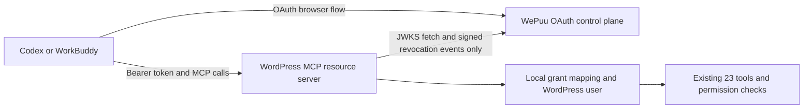

# Architecture

## Context

WePuu Platform supplies browser authorization for MCP clients that connect directly to a WordPress connector. It is a control plane, not a data plane. The reference connector remains the authority for the fixed tool catalog, WordPress permissions, draft-only write invariants, concurrency, idempotency, audit, and SSRF protections.

## System boundaries

The control plane may know that a tenant paired an exact canonical MCP endpoint. It must not receive the endpoint's tool calls, tool arguments, tool results, posts, pages, media, taxonomy values, SEO data, or email data.

## Logical components

### Authorization service

- Implements OAuth endpoints and metadata using a mature server component.
- Owns authorization transactions, codes, client registrations, refresh-token families, token issuance, revocation, and JWKS publication.
- Has no WordPress content API and no connector credentials.
- Uses an isolated storage adapter and KMS/HSM-backed asymmetric signing keys.

### Control API and web UI

- Manages platform accounts, tenants, site records, pairing attempts, consent orchestration, grant listings, and revocation.
- Cannot mint arbitrary user tokens from an administrator console.
- Uses explicit tenant membership and authorization on every object operation.

### WordPress connector resource server

- Publishes path-specific Protected Resource Metadata.
- Challenges unauthenticated requests with a Bearer `WWW-Authenticate` header pointing to that metadata.
- Validates the token locally, maps an opaque grant to a current local user, and installs that user only for the request.
- Applies scope as a ceiling, then executes every existing capability and object check.
- Keeps Application Password authentication independent and available.

## Canonical identifiers

- `resource`: the normalized, full HTTPS MCP endpoint, for example `https://example.com/wp-json/wp-auto/mcp`.
- `aud`: exactly one string equal to `resource`; origins, wildcards, aliases, trailing-slash variants, and sibling REST paths do not match.
- `site_id`: platform-generated opaque identifier for one WordPress blog/site.
- `grant_id`: opaque identifier representing one local WordPress user's authorization for one site and client/security context.
- `tenant_id`: mandatory platform partition key; never inferred solely from a user-supplied object ID.

Canonicalization happens before pairing is committed. A later endpoint, scheme, host, port, or path change suspends the connection and requires re-pairing.

## Authentication and authorization flow

1. A WordPress administrator explicitly starts pairing from wp-admin.
2. WordPress creates a high-entropy single-use pairing secret, stores only its hash, and redirects the browser to the platform.
3. The platform authenticates its account, validates the pairing proof, performs SSRF-safe endpoint verification, and assigns `site_id`.
4. An MCP client requests the resource and discovers PRM and AS metadata.
5. The client begins Authorization Code + PKCE S256 and supplies the exact `resource`.
6. The platform user selects a paired site, then returns to WordPress for local-user login and explicit consent.
7. WordPress creates the local `grant_id → wp_user_id` record and returns a signed, one-time completion result.
8. The authorization service issues a one-time code. The token endpoint requires the same `resource` and verifier.
9. The client sends the short-lived access token directly to WordPress.
10. WordPress validates it and executes the unchanged local authorization chain.

## Access-token validation order

The connector must reject on the first failed invariant:

1. exactly one Bearer credential is present in the `Authorization` header;
2. token structure and size are bounded;
3. `typ` and signing algorithm are allow-listed;
4. `kid` identifies an active or overlap key from the pinned issuer's JWKS;
5. signature is valid;
6. `iss` is an exact match;
7. `aud` is exactly the canonical endpoint and not a broad origin;
8. `iat`, `nbf`, and `exp` pass bounded-skew validation;
9. `jti`, `site_id`, `grant_id`, `sub`, and `scope` meet schema constraints;
10. the token's `site_id` is the locally paired site;
11. neither key, token, nor grant is locally revoked;
12. the local grant maps to an existing, active WordPress user;
13. requested tool category is inside the grant scope;
14. existing tool-specific WordPress checks pass.

Unknown algorithms, issuers, audiences, keys, grant states, malformed claims, cache states beyond their safety window, or ambiguous user status fail closed.

## Token and key lifecycle

- Access token target lifetime: 2–5 minutes; exact value is frozen after compatibility and clock-skew testing.
- Refresh tokens are opaque, high-entropy, hashed at rest, client-bound, and single-use.
- Refresh reuse revokes the full family and emits a security event.
- New public keys are published before signing begins. Retiring public keys remain available for at least maximum access-token lifetime plus clock skew and cache margin.
- Private key material never enters application configuration or the database.
- Unknown `kid` may trigger one bounded JWKS refresh; failure never falls back to accepting the token.

## Availability model

- Platform unavailable: no new pairing, login, code exchange, refresh, or platform-side revocation.
- WordPress may accept already issued, unexpired tokens using a safe cached JWKS and active local grant.
- WordPress-local revocation is immediate even when the platform is unavailable.
- Platform-originated revocation is delivered through an idempotent signed event; its worst-case enforcement is bounded by the access-token lifetime.
- Application Password direct access is not dependent on platform availability.

Per-request introspection is not part of the default architecture because it would insert the platform into the request path, reduce availability, and reveal request timing. A future requirement for immediate central revocation must be handled as a new ADR.

## Deployment direction, not authorization

Future implementation is expected to use TypeScript, an isolated OAuth service, a small control API, a web consent UI, PostgreSQL, optional Redis for ephemeral coordination, a managed KMS/HSM, a load balancer/WAF, and structured security logs. Phase 2.0.0 selects no cloud vendor and creates no deployment artifacts.

## Source baseline

- [MCP Authorization 2025-11-25](https://modelcontextprotocol.io/specification/2025-11-25/basic/authorization)
- [OAuth 2.1 draft-15](https://datatracker.ietf.org/doc/draft-ietf-oauth-v2-1/15/)
- [RFC 9700](https://www.rfc-editor.org/info/rfc9700/)
- [RFC 9728](https://www.rfc-editor.org/info/rfc9728/)
- [RFC 8414](https://www.rfc-editor.org/info/rfc8414/)
- [RFC 8707](https://www.rfc-editor.org/info/rfc8707/)
- [RFC 9207](https://www.rfc-editor.org/info/rfc9207/)
